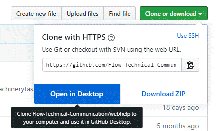

---
authorinformation:
  - null
  - Pieterjan Vandenweghe
keyword: null
---

# Cloning a repository

You can start working on a GitHub repository on your computer when make a clone of the cloud version. You can initiate the clone:

1. On the main page of the repository on GitHub.
2. In the GitHub Desktop tool.

## Cloning from the GitHub repository main page

This procedure assumes:

* You already created a repository or someone else already created a repository.
* You already have GitHub Desktop installed.
* Navigate to the main page of the repository.
* Click **Clone or Download** under the repository name.

  

* Choose **Open in Desktop**.

  

* Choose **Open Githubdesktop.exe**.

  GitHub Desktop opens on your computer and shows the **Clone a repository** windows with the repository URL already added .

* Choose a **Local path** to store the file on your computer.

  **Tip:** Use a path with not too many subfolders. This could create problems uploading files at a later stage since the path length of a file can't be &gt; 256 characters on Windows.

  C:/GitHub

* Choose **Clone**.

The repository is ready to use on your computer.

## Cloning a repository from GitHub Desktop

This procedure assumes:

* You already created a repository or someone else already created a repository.
* You already have GitHub Desktop installed.
* Open GitHub Desktop.
* Choose **File** &gt; **Clone repository...**.
* Do one of the following in the Clone a repository window.
  * In the **Github.com** tab, search or filter to a repository you are already contributing to.
  * In the **URL** tab, paste the URL of the GitHub repository.
* Choose a **Local path** to store the file on your computer.

  **Tip:** Use a path with not too many subfolders. This could create problems uploading files at a later stage since the path length of a file can't be &gt; 256 characters on Windows.

  C:/GitHub

* Choose **Clone**.

The repository is ready to use on your computer.

