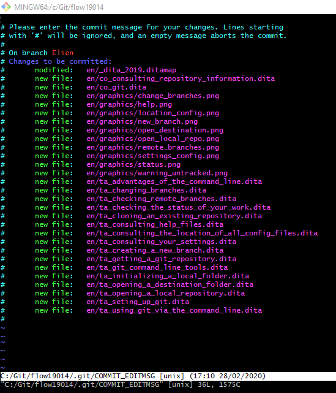
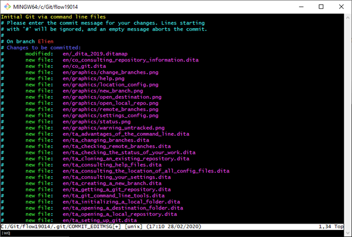

# Committing changes

1. Type `git commit`.

   An external editor opens so you can type in a message. If you are using Git Bash, a VIM editor is opened by default.

   

2. Type in a commit message or description.

   In the example below, the first line is the commit message.

   

3. On the last line, type :wq and press Enter to exit the editor.

