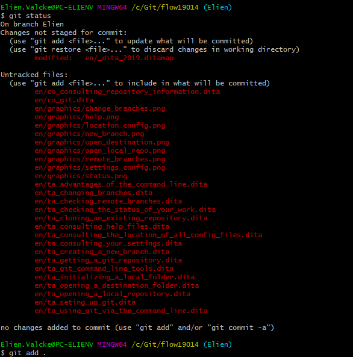

# Tracking untracked files

Between commits, you might have added files to the repository, such as new topics or screenshots. If you want to track the changes for these files, you have to add them to the repository.

1. Type one of the following:
   * `git add <file name>`: Add a specific file.
   * `git add .`: Add all untracked files.

     
2. Press Enter.

   **Note:** An [error](to_faq/ts_cannot_add_untracked_files.md) might occur.

