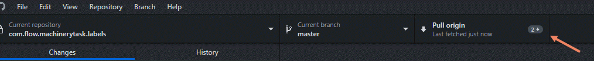

---
authorinformation:
  - null
  - Pieterjan Vandenweghe
keyword: null
---

# Pulling files from the cloud

You can pull or download files from the cloud whenever the copy on your computer is not up-to-date anymore. This happens for example when a collaborator pushed some content to the cloud. Whenever you see **Pull origin** with a number next to it, this means you are not up-to-date anymore.

1. Click **Pull origin** to download the latest version.

