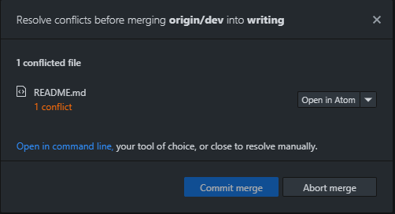
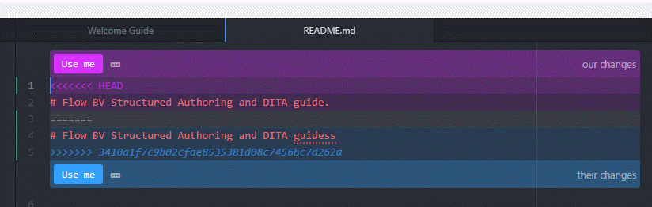

---
authorinformation:
  - null
  - Pieterjan Vandenweghe
keyword: null
---

# Resolving conflicts

This procedure assumes you installed Atom as text editor for GitHub Desktop.

You get the following error message when you try to upload a committed file with a conflict to the cloud:

**Note:** You see a list of files when there are conflicts in more than 1 file.

1. Choose **Open in Atom**.

   You get an overview of the conflict in Atom.

   

2. Do one of the following:
   * Choose **Use me \(our changes\)** to accept your change as final change.
   * Choose **Use me \(their changes\)** to accept the changes from the collaborator.
3. Save the file and switch to GitHub Desktop.

   The Resolve conflicts window shows **No conflicts remaining** for the updated file.

   

4. Repeat steps [2](ta_resolving_conflicts.md#step_mqr_mqj_flb) through [3](ta_resolving_conflicts.md#step_ufz_tqj_flb) for all remaining conflicts.
5. Choose **Commit merge**.

You resolved all the conflicts and are ready to synchronize the files to the cloud.

