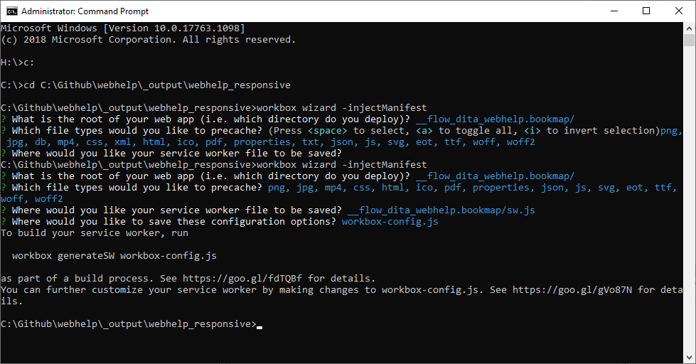

---
authorinformation:
  - null
  - Pieterjan Vandenweghe
keyword: null
---

# Precaching Files with Workbox CLI

## Creating the Workbox configuration file

1. Open the service-worker.js file.
2. Add the code `workbox.precaching.precacheAndRoute(self.__WB_MANIFEST, { ignoreURLParametersMatching:[ /.*/] });`.

   The piece of code after `__WB_MANIFEST,` is necessary to cache all files from the Oxygen XML Webhelp responsive. Without this the search will not work properly.

3. Open a command line terminal.
4. Change the current directory of the terminal to the parent folder of the index.html file.

   When your index.html file is stored in the folder C:\Github\webhelp\\_output\webhelp\_responsive\\_\_flow\_dita\_webhelp.bookmap, you need to set your current directory to C:\Github\webhelp\\_output\webhelp\_responsive.

   The command to change the current directory in a command line terminal is `cd` followed by the folder path.

   The command to change the drive in a command line terminal is typing the name of the drive followed by a colon.

   

5. Type the command `workbox wizard –injectManifest` to create the manifest wizard.
6. Use the arrows to select the folder.

   You get a list of all file formats that are saved in the subfolders.

7. Scroll down with the arrows and hit the space button to deselect files that do need to be cached.

   By default we deselect TXT files and DB files.

   **Note:** We you do NOT deselect the DB files, the PWA will not work.

8. Choose the default option folderpath/sw.js to save the new service worker file.
9. Choose the default option workbox-config.js to save the configuration options.

   The configuration options are all choices you made from step [6](./#step_gjz_hsl_flb).

   

10. Open workbox-config.js with a text editor and the following code below `"swDest"`.

    ```text
    ,
      "swSrc": "$folder$/service-worker.js"
    ```

    Change the %folder% with the name of your subfolder.

    **Note:** Do not forget to add the comma at the end of the `"swDest"` line.

    The file should look like this:

    ```text
    module.exports = {
      "globDirectory": "__flow_dita_webhelp.bookmap/",
      "globPatterns": [
        "**/*.{png,jpg,mp4,css,xml,html,ico,pdf,properties,txt,json,js,svg,eot,ttf,woff,woff2}"
      ],
      "swDest": "__flow_dita_webhelp.bookmap/sw.js"**,
      "swSrc": "\_\_flow\_dita\_webhelp.bookmap/service-worker.js"
    \};**
    ```

    This last step is temporary due to a bug in the Workbox which doesn't recognize the original service-worker.js as source or template service worker..

You created the workbox-config.js file with all the info on the files that should be cached and where everything will be saved. You only need to create this file the first you set up PWA for your website. When you would like to update the configuration, you can simple rerun this procedure again. This will overwrite the previous configuration.

## Injecting the service worker file

This procedure assumes you already created a Workbox configuration file.

1. Open a command line terminal.
2. Change the current directory to the folder where you saved the Workbox configuration file \(workbox-config.js\).

   The command to change the current directory in a command line terminal is `cd` followed by the folder path.

   The command to change the drive in a command line terminal is typing the name of the drive followed by a colon.

   

3. Run the command `workbox injectManifest`.

All file names in your project folder, except the file formats you excluded in the configuration, are saved in a sw.js file. Based on this file, all files will be cached when you visit the website.

