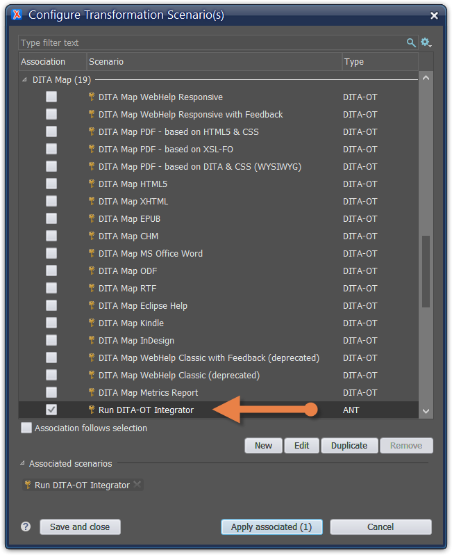

---
authorinformation:
  - null
  - Pieterjan.vandenwegh
category: Reference Guide
keyword: null
---

# Installing a DITA-OT plug-in with Oxygen XML

1. Copy the plug-in folder you want to add to your DITA-OT folder.
2. Go to your DITA-OT folder.

   C:\Program Files\Oxygen XML Editor 22\frameworks\dita\DITA-OT3.x\plugins

3. Paste the folder on that location.
4. Start the Oxygen XML editor as administrator: right-click on the program icon and choose **Run as administrator**.

   

5. Open any DITA file.
6. Choose **Document** &gt; **Transformation** &gt; **Configure Transformation Scenario\(s\)**.

   **Note:** Make sure all transformation scenarios are visible by clicking the settings icon  and selecting the option **Show all scenarios**.

   

7. Select the **Run DITA-OT Integrator** scenario.

   

8. Click **Apply associated**.

