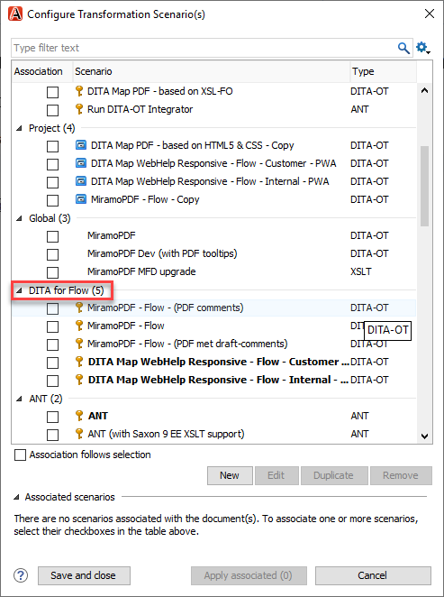
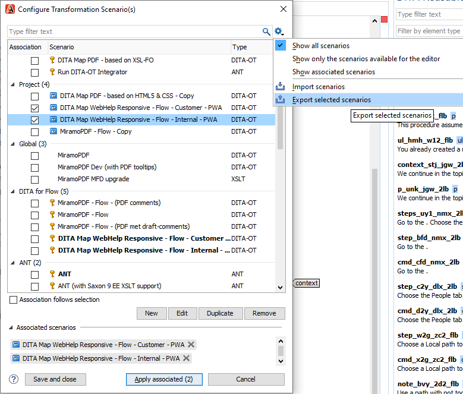
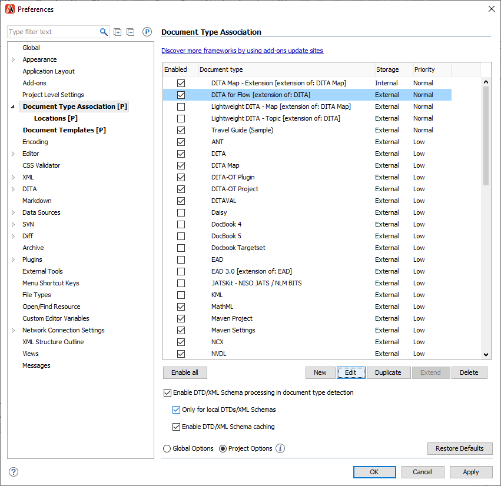
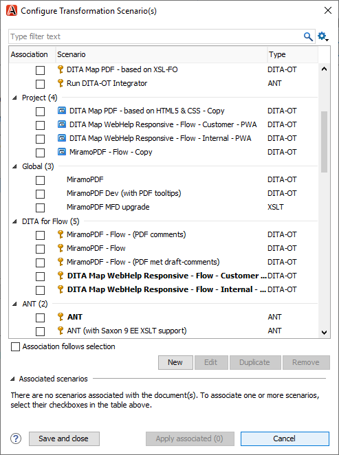

# Grouping transformations in the Configure Transformation Scenario\(s\) view

If you have created a custom framework for a customer, you can group the transformations separately, as seen below.

1. In the DITA Maps Manager, click .
2. In the Configure Transformation Scenario\(s\) window, select the transformation scenarios you want to add to a group.
3. Click the **Settings** icon and click **Export selected scenarios**.

   

4. Name and save the .scenarios file where you can easily find it.
5. Click **Cancel** to close the Configure Transformation Scenario\(s\) window.
6. In the menu bar, click **Options** &gt; **Preferences** &gt; **Document Type Association**.
7. Under Document Type Association, click the grouping name you want the transformation to be a part of and click **Edit**.

   

8. In the Document type window, click the **Transformation** tab and click the **Import scenarios** icon.

   

9. Double-click the .scenarios file you exported earlier.

   The transformations you can import are shown.

   

10. Click **Import**.

    The transformations have been added to the group.

    

