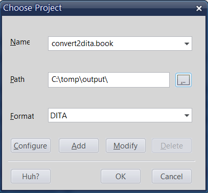

# Step 3: Conversion — Save the MIF files as DITA

You need to have:

* FrameMaker 11
* MIF2Go
* The MIF2Go ini files, which contain the conversion routines: \_m2dita.ini, DITAtask.ini, DITAtopic.ini, DITAreference.ini, DITAconcept.ini
* A FrameMaker book with MIF files to convert.
* Open the FrameMaker book.
* Choose **File** &gt; **Save Using Mif2Go**.
* In the **Path** box, select the output folder where the MIF2Go ini files are.

  

* Click **OK** and wait for a couple of seconds.

The files in the book will be converted to DITA and the book itself will become a DITA map.

The next step is to [clean up and validate the DITA topics and maps in Oxygen XML](postprocessing_clean_up_and_validate_the_dita_files_in_oxygen.md).

