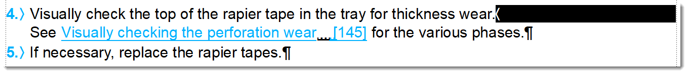

# Fixing line breaks

By default, MIF2Go converts line breaks \(SHIFT+ENTER\) to spaces, because line breaks don't really exist in the XML world. If necessary, you can change this in the \_m2dita.ini:

* To convert ALL line breaks to hard returns \(ENTER\):

  ```text
  [HTMLOptions]
  XMLBreakPara = Yes
  ```

* To do so selectively for individual paragraph formats:

  ```text
  [HTMLParaStyles]
  ParaFmt = XMLBreak
  ```

However, line breaks may have been used for various reasons, as shown in the examples below. Therefore, it may be a better idea to check the line breaks in FrameMaker first and fix them there instead of having them all converted by MIF2Go.

## Example 1: Step followed by a tip


In this case, you need to do the following:

* Replace the line break with a hard return \(¶\).
* Give the second sentence \("If a new brush is mounted \(...\)"\) the paragraph style `tip`.

The conversion will then turn the second sentence into a `note` of `@type="tip"`

## Example 2: Line break used for no reason


The word "This" in the second sentence refers to something which was mentioned in the first sentence, so you can just remove the line break.

## Example 3: Separate list item


You can replace the line break with a hard return \(¶\) and give the second cross-reference in this cell \("Phases of the perforation wear"\) the paragraph style `listitem`.

## Example 4: Paragraph in `info` element



You can replace the line break with a hard return \(¶\) and give the paragraph with the cross-reference the paragraph style `stepinfo`. This paragraph will then be converted to an `info` element inside a `step`.

## Example 5: Line break used for extra spacing below the paragraph


You can just delete this line break. Extra spacing below the paragraph will be handled by the style sheet.

## Example 6: Line breaks in an unordered list in a note


In this case, you will need to do the following:

1. Replace the line breaks with hard returns \(¶\).
2. Give the stem sentence the paragraph style `caution` \[A\].
3. Give the bulleted list items the paragraph style `notelistitem` \[B\] because they are list items inside a note.


The following conversion routine in MIF2Go will put the list items in a `note`:

```text
[DITAParents]
notelistitem=$text note ul li
```

This will result in two `note` elements in the DITA topic, but you can simply merge them together by pressing the **Backspace** key at the position indicated in the image below.


