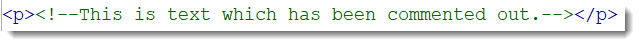
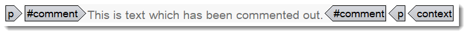

---
authorinformation:
  - null
  - null
  - null
  - Yves
category: null
keyword: null
---

# Commenting out text in DITA files

There may be situations where you wish to "hide" text in your DITA topics temporarily without using the conditional attributes \(`@audience`, `@product`, `@platform` etc.\). In those cases, you can "comment out" the text, which means that the text will still be in your DITA topics, but it will not be displayed when the topic is published.

1. Open the file in Oxygen XML and click the **Text** button at the bottom of your screen.
2. In **Text** mode, select the text that you want to comment out.
3. Right-click the selected text and choose **Toggle comment**.

   The selected piece of text turns green and is enclosed in `<!-- -->`.

