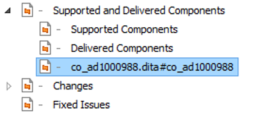

---
authorinformation:
  - null
  - null
category: null
---

# Manually adjust the automatically converted DITAMAP in Oxygen XML

1. Open the automatically generated DITAMAP in Oxygen XML.
2. Look for topics that have a strange topic title in the **DITA Maps Manager**.

   "co\_ad1000988.dita\#co\_ad1000988"

   

3. Open one of these topics as well as the topic that immediately precedes it.

   In this case, "co\_ad1000988.dita\#co\_ad1000988" and "Delivered Components".

   **Note:** You will notice that the topic with the correct topic title is empty and the one with the incorrect topic title contains the contents of the former.

4. Copy the contents of this topic into the topic with the correct topic title and delete the topic with the faulty topic title by right-clicking it and selecting **Remove from Disk**.

   

5. Repeat step [2](ta_manually_adjust_the_automatically_converted_ditamap_in_oxygen_xml.md#step_fb4_xpp_xkb) to [4](ta_manually_adjust_the_automatically_converted_ditamap_in_oxygen_xml.md#step_dpm_4qp_xkb) for all topics with an incorrect topic title.
6. Check the entire DITAMAP for completeness, by selecting the **Validate and Check for Completeness** button in the **DITA Maps Manager** pane.

   

7. Select **Check** in the DITA Map Completeness Check window that appears.

   The **DITAMAP Completeness Check** will appear at the bottom of the screen.

8. Click on all the red **Error** messages within the completeness check and solve the errors within all topics of the DITAMAP.
9. Perform more validation checks until there are only yellow **Warning** messages left in the completeness check.

   

