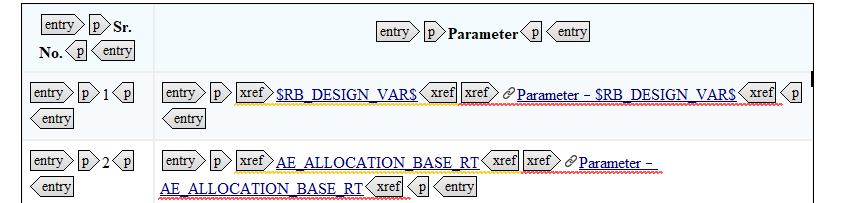
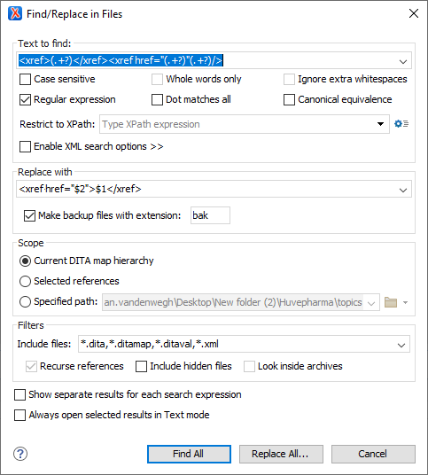

---
authorinformation:
  - null
  - null
category: null
keyword: null
---

# Finetuning DITA files in Oxygen XML

**Note:** Working with regular expressions only works when you open the Oxygen XML editor in text mode.

## Delete navtitle in DITAMAP files

1. Select your DITAMAP in **DITA Maps Manager**.
2. Right-click on the file and select **Find/Replace in files...**.
3. Add the following info:

   * **Text to find:**: `navtitle="(.+?)"`
   * **Restrict to Xpath:**: `topicref`
   * **Replace with**: leave it empty.

   **Note:** Make sure the option **Regular Expression** is ticked.

   

4. Select **Replace all.**

## Delete `alt` in DITA files

1. Select your DITAMAP in **DITA Maps Manager**.
2. Right-click on the file and select **Find/Replace in files...**.
3. Add the following info:

   * **Text to find:**: `<alt>(.+?)</alt>`
   * **Replace with**: leave it empty.

   **Note:** Make sure the option **Regular Expression** is ticked.

   

4. Select **Replace all.**

The `@alt` is removed in the `image` element.

## Finetune `xref` in DITA files

The `xref` is not always converted correctly to DITA. In some cases you find two `xref` elements right after each other.

The first `xref` contains text and the second `xref` contains the actual link. We need to merge this to have correct DITA.

.

1. Select your DITAMAP in **DITA Maps Manager**.
2. Right-click on the file and select **Find/Replace in files...**.
3. Add the following info:

   * **Text to find:**: `<xref>(.+?)</xref><xref href="(.+?)"(.+?)/>`
   * **Replace with**: `<xref href="$2">$1</xref>`.

   **Note:** Make sure the option **Regular Expression** is ticked.

   

4. Select **Replace all.**

