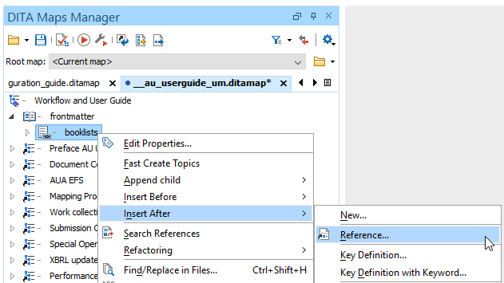

---
authorinformation:
  - null
  - null
category: null
keyword: null
---

# Add the warehouse, subject scheme, external links and keys DITAMAPS to the BOOKMAP

1. In the **DITA Maps Manager**, in your bookmap: select the white arrow to the left of **Frontmatter**.
2. Under **Frontmatter**, right-click **booklists** and select **Insert After** &gt; **Reference…**.

   

   The Insert Topic Reference window opens.

3. Search for each ditamap as follows, and add it to your bookmap by selecting **Insert and close**:
   1. Look for the \_warehouse folder within the folder containing your DITA files in the 03\_dita folder, open it and select \_warehouse.ditamap.
   2. Look for the \_subject\_scheme folder in the 03\_dita folder, open it and select \_subjectscheme.ditamap.
   3. Look for the \_external\_links.ditamap in the folder containing your DITA files and select it.
   4. Look for the keys ditamap file \(specific to your project\) in the folder containing your DITA files and select it.

      **Note:** Within the keys ditamap, you will have to adjust the name of the software as well as the software version to match the software name and version of the set of documents that you are currently converting.

      

