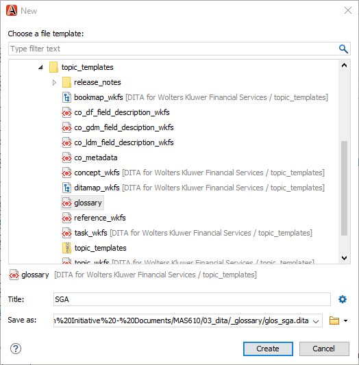
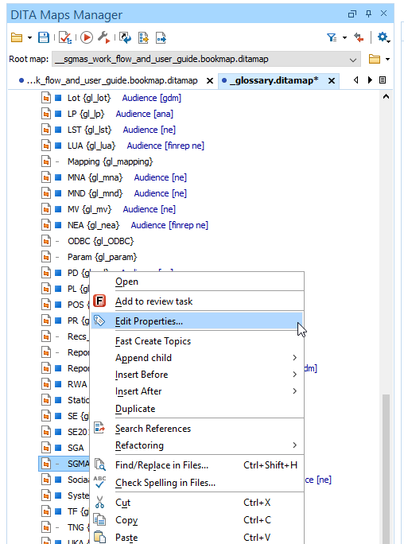
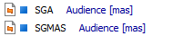

---
authorinformation:
  - null
  - null
category: null
keyword: null
---

# Add a new glossary topic to the glossary DITAMAP

When you open the \_glossary.ditamap in the **DITA Maps Manager** you will see that every glossary item is added as a separate glossary topic. The glossary topics are alphabetically ordered.

1. Proceed as follows to add a new glossary topic:
2. In the **DITA Maps Manager**, select the glossary topic that should precede the glossary topic that you are about to add and select **Insert After** &gt; **New...**.
3. Select the **glossary** topic template and fill in the correct name in the **Title:** text field.

   **Note:** Save it in the \_glossary folder in the 03\_dita folder.

   

4. Right-click on the glossary topic that you have just created in the **DITA Maps Manager** and select **Edit Properties...**.

   

   The Edit Topic Reference Properties window opens.

5. Go to the **Profiling** tab, select the suitable audience type and select **OK**.

   

   The audience type will appear next to the glossary topic in the **DITA Maps Manager**.

   

**Note:**

You should only add an audience type to:

* the glossary topics that only occur in the document that you are currently working on.
* the glossary topics that occur in your current document as well as in other documents and that have already received an audience type.

