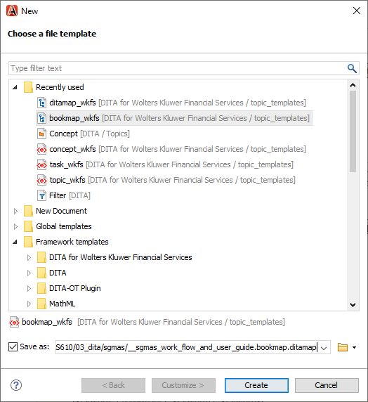

---
authorinformation:
  - null
  - null
category: null
keyword: null
---

# Create a new BOOKMAP

1. Select **File** &gt; **New...** in OxygenXML.
2. Select the Bookmap template \(specific to the project you are working on\).

   If you are working on a project of Wolters Kluwer Financial Services, select the **bookmap\_wkfs** template.

3. Name your new bookmap \(same name as automatically converted ditamap\) and save it in the correct folder.

   **Note:** Make sure to include bookmap in the name of your bookmap file. E.g. \_\_sgmas\_work\_flow\_and\_user\_guide.bookmap.ditamap.

   **Note:** Your bookmap needs to be saved at the highest level of the folder structure; at the same level of the\_subject\_scheme folder. All the ditamaps that belong to your bookmap \(as well as your \_graphics and \_warehouse folder\) need to be saved one folder level lower.

4. Select **Create**.

   

5. Add your bookmap to the **Master Files** directory of the wolters\_kluwer.xpr project file.

   1. In the **Project** pane, select the down arrow next to currently opened project and select **Open Project...**.
   2. Select the wolters\_kluwer.xpr file and select **Open**.
   3. Right-click **Master Files** and select **Add Files...**.

      **Note:**

      If you don't see the **Master files** directory within the project that you opened in the **Project** pane, do any of the following to enable **Master Files** support:

      * Right-click the wolters\_kluwer.xpr file within the **Project** pane and select **Enable Master Files Support**.
      * Select  near the top right of the **Project** pane and select **Enable Master Files Support**.

   4. Select the bookmap that you just created in the folder structure and select **Open**.

   **Note:** When you add your bookmap to **Master Files**, you will be able to move or rename a resource without ending up with a number of broken references. All references to this resource will automatically be updated within the scope of the entire project.

   **Tip:** You can add a shortcut to the folder containing your bookmap and other DITA files within the **Project** pane. Simply, drag and drop this folder from File Explorer to the project tree in the **Project** pane.

