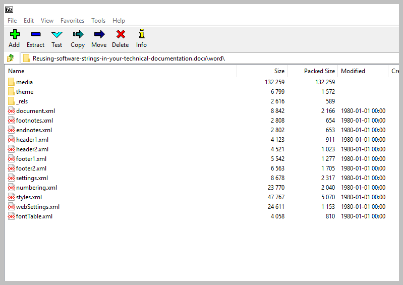
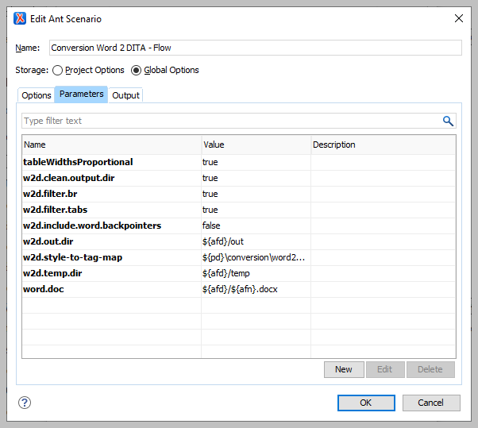

# Converting DOCX files using DITA-OT plug-in

You can run the conversion to DITA with the org.dita4publishers.word2dita DITA-OT plug-in. This plug-in is by default added to the build-in DITA-OT in Oxygen XML or can be downloaded from the DITA-OT website.

The plug-in is developed by Elliot Kimber and is documented in great detail in the _DITA for Pusblishers User Guide_.

The default plug-in only includes a basic conversion mapping table and needs to be customized with a more advanced mapping table to map the Microsoft Styles \(Paragraph or Character style\) with the various DITA elements. The mapping differs a bit depending on the elements you want to use and how this is nested in the DITA architecture.

When the set of documentation you want to convert is using the same template and Microsoft Styles, you can reuse the mapping table for all documents. When a mix of Styles is used, you have to finetune the mapping table per document.

**Related information**

## Mapping table

The mapping table is saved as an XML file. You can find the default file in the xsl subfolder of the org.dita4publishers.word2dita plug-in with the file name word-builtin-styles-style2tagmap.xml.

Save a copy of this file locally to start customizing the mapping table.

At Flow bv, we already have a highly customized mapping table file. You find this file in the DITA repository on GitHub. The file is stored as flow-style2tagmap.xml in the conversion\word2dita-plugin subfolder.

This mapping table is based on the basic heading styles in Microsoft Word. If custom Microsoft styles are used to define headings, you have to update the mapping file.

## Why an X in DOCX

The X in DOCX stands for Office Open XML standard. This means that our Word file is in the back-end just another XML file. You can very easily test this when you open a DOCX file with a ZIP manager such as 7-zip or WinZip.

You find the most important files in the word subfolder:

* document.xml: the text of the DOCX file.
* The media folder contains all images used in the DOCX file.

## Converting DOCX file with Oxygen XML

1. In your Oxygen XML editor, choose **File** &gt; **Open** to open the DOCX file.

   The DOCX file opens in the Archive Browser window.

2. In the word folder, double-click the document.xml file.
3. Choose **Document** &gt; **Transformation** &gt; **Configure transformation scenario\(s\)** or simply click the  button to configure a new transformation scenario.
4. Select the **DOCX DITA** predefined transformation scenario and click **Duplicate**.
5. Give a meaningful name to your transformation scenario and go to the **Parameters** tab.
6. Add the parameters you need for your transformation.

   You find the default list of XSLT transformation parameters for this plug-[here](http://www.dita4publishers.org/d4p-users-guide/user_docs/d4p-users-guide/word2dita/word-to-dita-plugin-usage.html).

   The most important parameters are:

   * **w2d.style-to-tag-map**

     URI to your mapping table file.

     At Flow bv, we already have a highly customized mapping table file. You find this file in the DITA repository on GitHub. The file is stored as flow-style2tagmap.xml in the conversion\word2dita-plugin subfolder.

   * **w2d.filter.br**

     Filters out all literal break characters when set to true.

   * **w2d.filterTabs**

     Filters out all literal tab characters when set to true.

   * **w2d.include.word.bookmarks**

     When set to true, the resulting DITA files include `data` elements that reflect the bookmark start and end markers. This can be useful in debugging cross reference processing or other uses of bookmarks. The default is false.

   * **w2d.temp.dir**

     Directory where temporary files are stored.

   * **w2d.clean.output.dir**

     Deletes any files in the output directory before running the generation when set to true .

   * **w2d.include.word.backpointers**

     Excludes the `@xtrf` and `@xtrc` attributes when set to false.

   

7. Click **OK** to run the transformation and create DITA topics.

   In the Results window you can follow the progress of the transformation and you can also see if some styles are not mapped yet.

   When some Microsoft Word Styles are not mapped, you can add these to the mapping table with the corresponding DITA element. Run the transformation till all the necessary styles are mapped.

You still need to apply some extra postprocessing to create valid DITA topics. With this postprocessing we minimize the number of manual changes.

