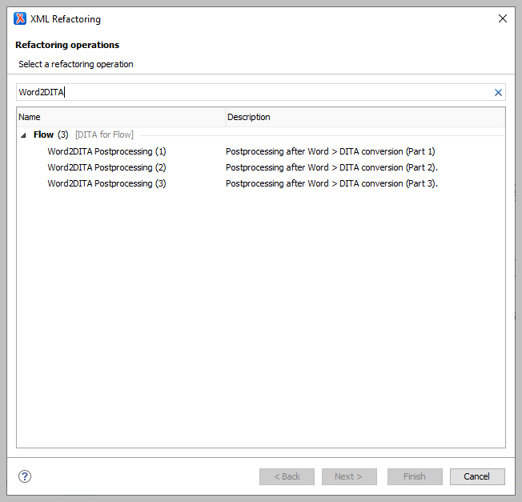

---
authorinformation:
  - null
  - Pieterjan Vandenweghe
keyword: null
---

# Postprocessing the DITA files in Oxygen XML

The DITA topics we created with transformation scenario are mostly likely not 100% valid DITA topics. Task topics are for example the most difficult to convert because there are a lot of nesting possibilities in this content type which is difficult to reproduce in one single transformation. With some predefined XSLT postprocessing you can edit the files in such a way that manual changes to the topics are limited as much as possible.

You can find the Flow bv refactoring operations in the DITA repository on GitHub in the folder OxygenXML\refactoring.

You must copy the following refactoring files to your framework:

* word2dita-1.xml
* word2dita-1.xsl
* word2dita-2.xml
* word2dita-2.xsl
* word2dita-3.xml
* word2dita-3.xsl

See [Adding refactoring operations to the Oxygen XML editor](../../../co_xml_editors/co_oxygen_xml/to_guidelines_and_tips_oxygen_xml/adding_refactoring_script_to_the_oxygen_project.md) to add the refactoring operations correctly.

## word2dita-1.xsl

The word2dita-1.xsl refactoring operation makes the following changes to the DITA topics:

* It fixes the nesting level in the task topics. Elements such as `stepresult` or `info` are on the same level in XML file as a `step` after the initial conversion. The refactoring operations makes all this kind of elements children of the preceding `step` element as required by the DITA specifications.
* It wraps all elements before the first step in a `context` element, except if the preceding element is a `prereq` element.
* It fixes `title` elements in a `figure` or `table`. These `title` elements are initially set as a sibling of the `table` and `figure` element.

## word2dita-2.xsl

The word2dita-2.xsl refactoring operation makes the following change to the DITA topics:

* It selects all the different `step` elements which are nested in different `steps` elements after the initial conversion and puts them all in one `steps` element.

## word2dita-3.xsl

The word2dita-3.xsl refactoring operation makes the following changes to the DITA topics:

* It removes the empty `info` and `context` elements that are in some cases added by the word2dita-1.xsl refactoring operation.
* It makes the following changes in an `image`:
  * It removes the `alt` elements in a `image`
  * It removes the `@width` and `@height` attributes
* It replaces the `@colwidth` of a all columns in a table with the default `1*`.

## Running the postprocessing refactoring operations in Oxygen XML

**Note:** Run the refactoring operations in the correct order to get an optimal result.

1. Open the initially converted DITAMAP in the DITA Maps manager.
2. Right-click on the DITAMAP and choose **Refactoring** &gt; **XML Refactoring**.
3. Select the **Word2DITA Postprocessing \(1\)** refactoring operation and click **Next**.

   

4. Set the **Scope** to **Current DITAMAP hierarchy** and click **Finish**.

   If you want to double check the changes before applying them, you can also choose **Preview** before clicking the **Finish** button.

5. Repeat step [2](./#step_r5g_z3p_cnb) but this time you select the **Word2DITA Postprocessing \(2\)** refactoring option before you repeat step [4](./#step_of2_ykp_cnb).
6. Repeat step [2](./#step_r5g_z3p_cnb) but this time you select the **Word2DITA Postprocessing \(3\)** refactoring option before you repeat step [4](./#step_of2_ykp_cnb).

## Adding the media files

The link to the media files in the DITA topics is by default set to a media subfolder of the output folder where the DITA topics are saved. The media files itself are not exported by default to this folder during conversion but you can add them very easily.

1. Open the DOCX file in the Archive Browser of your Oxygen XML editor.
2. Select the media folder.
3. Right-click and choose **Extract**.

   

4. Extract the files to correct folder.

